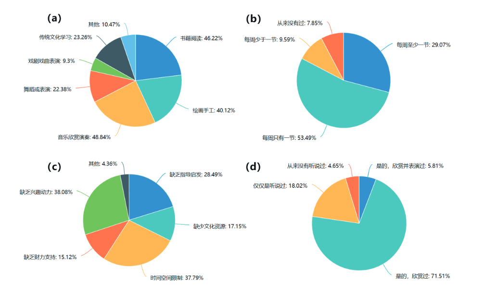
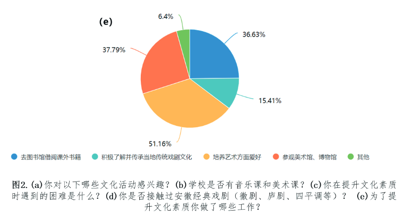
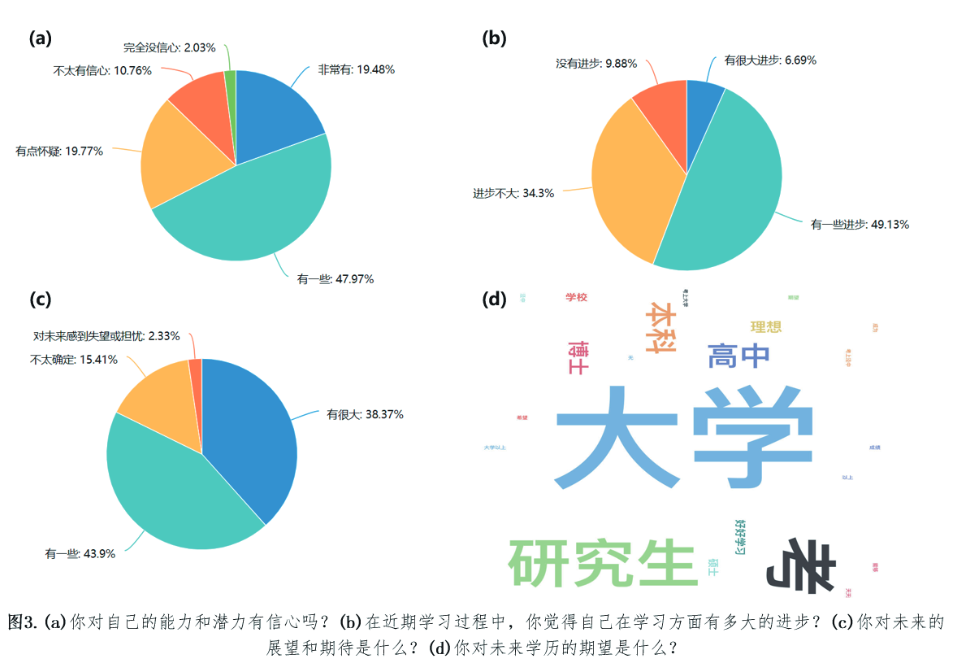

# 上科大历年实践报告汇总

## 23

泾县留守儿童自我提升意识较强，但社会支持相对匮乏，所幸教育状况总体得到改善。就自我提升而言，其自我认知较为清晰，有一定升学规划及较高的教育预期。然而，其综合素质相对不足，体现在艺术审美不足、文娱活动缺失。就社会支持来看，校方硬件设施合格而师资力量稍弱，社区支持薄弱，政府每年动态追踪留守儿童数量，积极制定并推行相关支持政策。

因此，如图 2 所示，我们对留守儿童的兴趣爱好与现有素质教育程度进行调研，结果显示该校学生在音乐、美术、舞蹈等方面爱好广泛，大部分情况下也能够保证一周有一节美术课和音乐课；有过半数的同学曾经参加过兴趣班以培养爱好特长，也有部分同学选择参观博物馆、美术馆或借阅购买书籍来提升素养。提及当下兴趣培养面临的困难，多数同学表示存在缺乏动力、时间空间受限以及缺乏启蒙指导等问题。此外，我们还调研了当地传统戏曲文化的传承情况，结果显示徽剧的普及程度极高，多数同学听说过或欣赏过，甚至有少数同学学习并登台表演过。

样本学生对于自己的学历期望大多数在本科及以上，但提到对未来的期待和自身潜力时，同学们偏向于选择“有一些”这类小幅度的肯定，暗示其内心对未来并没有很坚定的想法与规划，这也进一步反映了生涯规划类辅导教育对留守儿童来说能起到关键性的作用。

## 22

无安徽泾县

## 21

19 级重点关注的就是生涯规划的教育

> 2.2 生涯规划文献
> 陈坚，张佳佳认为，农村学生职业规划能力指导体系比较薄弱，职业规划意识淡薄且指导内容简单形式单一，农村地区的职业规划指导才逐渐被重视，但仍处于不成熟阶段，存在相当多的问题。针对这些问题，作者提出了如下的解决方案:完善课程设置，提高农村学生职业规划能力；让教师队伍构成合理化，聘请专职教师担任教学任务；加大政府支持投入力度，使学生职业规划指导规模化、制度化、规范化；建立相关协调机制并加强监督管理作用，使各部门相互配合。范先佐在湖北、安徽、湖南、河南调查了留守儿童的基本情况。作者总结了农村留守儿童面临的教育问题，有安全问题、学习问题、品行问题、心理问题。其中一个有价值的统计结果是 78.4%的教师认为“父母外出打工后，孩子的成绩变差了”，54.5%的教师认为“父母外出打工的孩子学习成绩一般较差”。在心理问题上年龄较小的孩子表现更突出，女生比男生突出。作者把这些教育问题归结于家庭教育的缺失、学校管理的失控与教育的失误、城乡“二元分割”。其中一个比较有趣的观点是学校寄宿生活能够在一定程度上消解留守儿童的心理问题，提高自理和合作能力，而不寄宿学校的留守儿童在亲戚和学校之间的“失控区”容易沾染不良习气。这正是泾县稼祥中学托教班建立的初衷[2]。然而，董世华的《我国农村寄宿制学校问题研究》提到了农村寄宿制学校学生生活与学习机械结合，失去课余生活的问题。这个问题在往年的调查中也有体现[3]。

徐校长表示，留守儿童托教班实行一月放三天的制度。周末，同学们会在学校进行兴趣选修课程，包括书法、球类运动、信息技术等。徐校长也承认，学校暂时未对学生进行专门的生涯规划教育。

但是，作为补充，班会课上会有主题教育；而班主任和任课老师也会和学生谈及生涯规划。这在我们和班主任的采访中得到证实。另外，学校有专门的心理老师。学校采取主动被动相结合的方式提供心理咨询，这也是对学生的帮助。

第三次问卷结果表明，上过生涯规划课程的同学会对未来的规划更加清晰却也更加悲观。

试图让当地留守儿童了解自我，把握未来。课程中还包含了丰富多样的活动，如写信给未来的自己，让他们对未来有所期待，树立理想。
